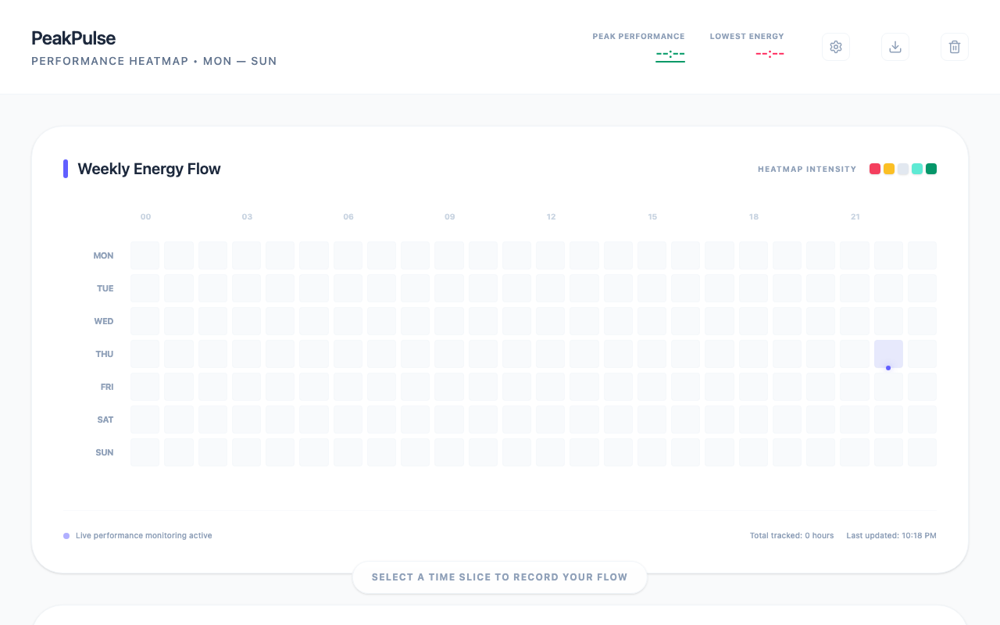

# PeakPulse
## Try it out!
Live demo is available here: [https://peakpulse-598464211339.us-west2.run.app](https://peakpulse-598464211339.us-west2.run.app)


An energy mapping system that visualizes your weekly performance heatmap to identify peak productivity windows.


## Demo


## Productivity Value
Working against your natural circadian rhythm is inefficient. PeakPulse allows you to log your energy levels and mood across a 24-hour cycle. By analyzing this data, it helps you discover your personal "Peak Performance" hours and "Slump" times, enabling you to schedule deep work when you are most capable and rest when you need it.

## How to Run & Test
This project uses Vite and requires Node.js.

1. Install dependencies:
   ```bash
   npm install
   ```
2. Start the development server:
   ```bash
   npm run dev
   ```
3. Click and drag across the grid to select time slots, then assign an energy state (e.g., Productive, Burned-out). Review the generated hourly trend chart.
